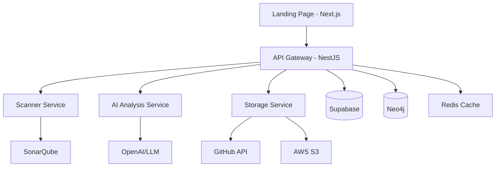

# 🛡️ SentinelHub

<div align="center">

**DevSecOps Intelligence Platform**

*Automated code scanning, vulnerability detection, and AI-powered security insights*

[](https://opensource.org/licenses/MIT)
[](https://nextjs.org/)
[](https://www.typescriptlang.org/)
[](https://tailwindcss.com/)
[](https://supabase.com/)

Built by **Sarah Henia** for **The SamurAI**

</div>

---

## 🌟 Overview

SentinelHub is a DevSecOps intelligence platform that scans code from multiple sources (GitHub, S3, manual uploads), detects vulnerabilities using SonarQube, and provides AI-powered security insights. Built with a microservices architecture using modern web technologies.

### 🔥 Core Capabilities

- **Multi-Source Scanning** - GitHub repos, S3 buckets, direct uploads
- **Security Analysis** - SonarQube integration + custom rules  
- **AI Intelligence** - OpenAI-powered vulnerability explanations
- **Real-Time Monitoring** - Live scan progress with WebSocket updates
- **Role-Based Access** - Admin/user authentication with 2FA
- **DevOps Integration** - Grafana, Prometheus, n8n automation

---

## 🏗️ Architecture



### 🚀 Technology Stack

**Frontend Architecture**
- **Next.js 15** with App Router - Server-side rendering & optimization
- **TypeScript** - Type-safe development with strict mode
- **Tailwind CSS v4** - Utility-first styling with custom animations
- **Headless UI** - Accessible, unstyled UI components

**Backend Microservices**
- **NestJS** - Scalable Node.js framework with decorators
- **Redis** - High-performance caching and session management
- **WebSockets** - Real-time scan progress and notifications

**Database Architecture**
- **Supabase (PostgreSQL)** - User management, authentication, scan history
- **Neo4j** - Graph database for code dependency mapping
- **Multi-database strategy** - Optimized for different data patterns

**DevSecOps Pipeline**
- **SonarQube** - Static code analysis and security scanning
- **Docker** - Containerized microservices deployment
- **GitHub Actions** - CI/CD automation and testing
- **Grafana + Prometheus** - System monitoring and metrics

**AI & Intelligence**
- **OpenAI GPT-4** - Vulnerability explanations and recommendations
- **Custom AI pipelines** - Code relationship analysis

---

## 🚀 Quick Start

### Prerequisites
- Node.js 18+, Docker, Supabase account

### Setup
```bash
git clone https://github.com/sarahhenia20/sentinelhub.git
cd sentinelhub
npm install
cp .env.example .env.local
# Configure your environment variables
npm run dev
```

### Key Environment Variables
```env
NEXT_PUBLIC_SUPABASE_URL=your_supabase_url
NEXT_PUBLIC_SUPABASE_ANON_KEY=your_supabase_key
GITHUB_CLIENT_ID=your_github_oauth_id
OPENAI_API_KEY=your_openai_key
SONAR_TOKEN=your_sonarqube_token
```

---

## 📄 License

MIT License - see [LICENSE](LICENSE) file.

---

<div align="center">

**Built by Sarah Henia for The SamurAI**

*DevSecOps Intelligence Platform*

</div>